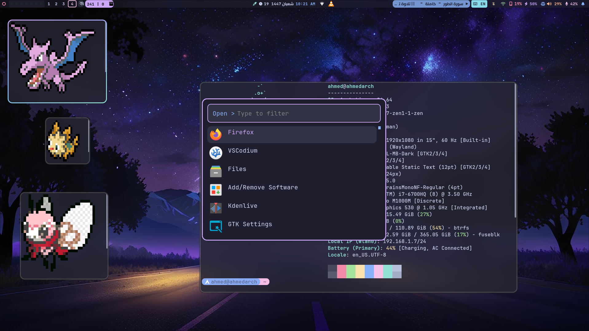
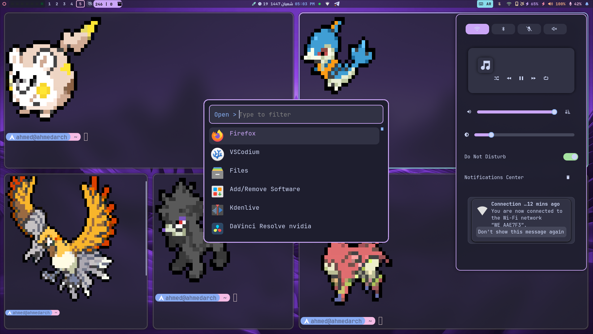
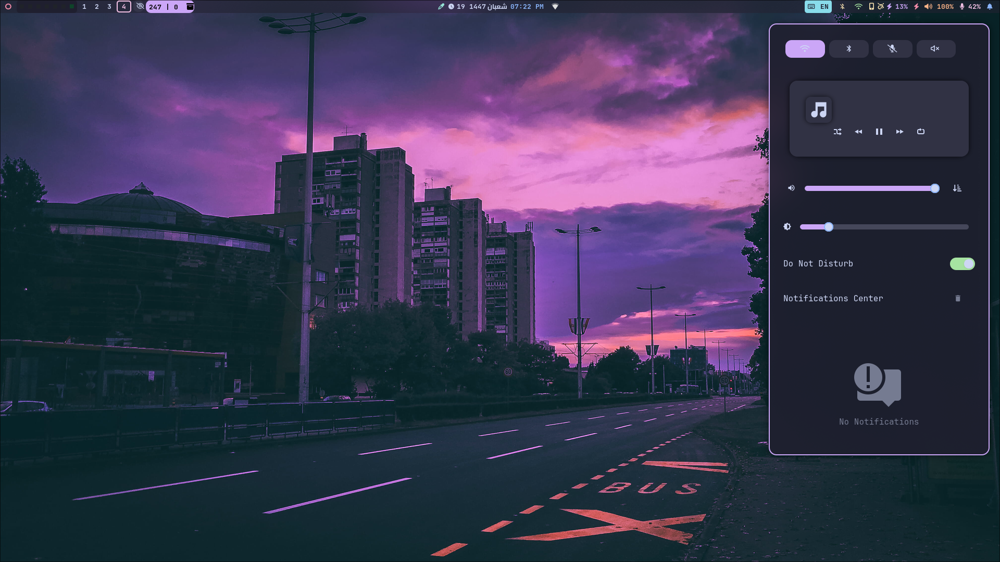
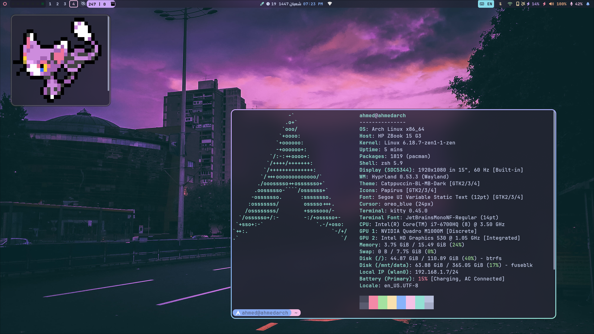

# 🍙 My Hyprland Dotfiles

Welcome to my personal **Hyprland** configuration (dotfiles) on Arch Linux.

## 🛠️ Software & Tools

| Category | Component |
|----------|-----------|
| **Window Manager** | [Hyprland](https://hyprland.org/) |
| **Status Bar** | Waybar |
| **Shell** | Zsh |
| **Terminal** | Kitty |
| **App Launcher** | Rofi |
| **Notifications** | SwayNC |
| **OSD** | SwayOSD |
| **Logout Menu** | wlogout |
| **Audio Visualizer** | Cava |
| **GTK Settings** | nwg-look |
| **Theme** | Catppuccin |

 

## 🍧 Waybar Configuration

Here is a detailed breakdown of the modules used in my Waybar configuration:

### ⬅️ Left Modules
| Module Name | Type | Description |
| :--- | :--- | :--- |
| `custom/power` | **Custom** 🛠️ | Power Menu / Logout (wlogout) |
| `custom/gh_heatmap` | **Custom** 🛠️ | [GitHub Activity](https://github.com/ad1822/weekly-github-waybar-module/tree/dev) (Weekly Heatmap) |
| `hyprland/workspaces`| Built-in 📦 | Workspace Switcher |
| `idle_inhibitor` | Built-in 📦 | Toggle to keep screen awake (Coffee Mode) |
| `custom/update` | **Custom** 🛠️ | System Updates (Pacman/AUR) |

### ⏺️ Center Modules
| Module Name | Type | Description |
| :--- | :--- | :--- |
| `custom/colorpicker` | **Custom** 🛠️ | Screen Color Picker Tool |
| `custom/hijri` | **Custom** 🛠️ | Hijri Calendar Date (**For Muslims**) |
| `clock` | Built-in 📦 | Time & Gregorian Date |
| `custom/privacy-dots`| **Custom** 🛠
## 📸 Gallery

  
  
    
  
  

 

## 📂 Structure
- **.config/**: Contains configurations for Hyprland, Waybar, Kitty, etc.