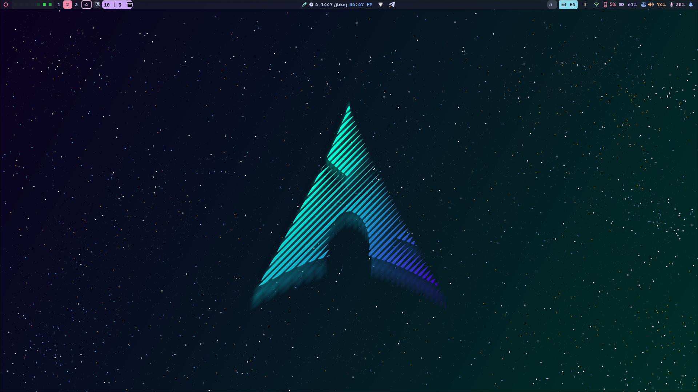
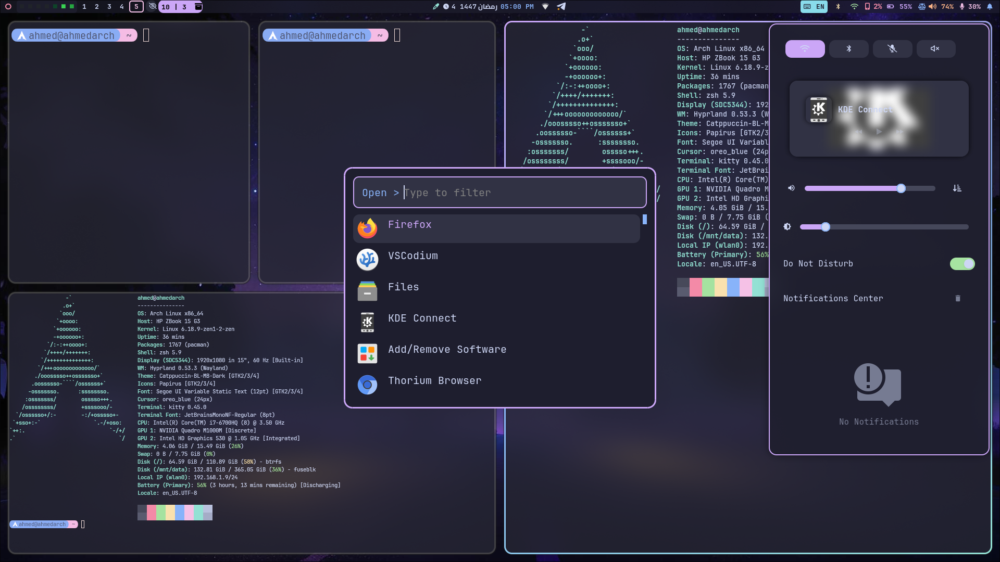
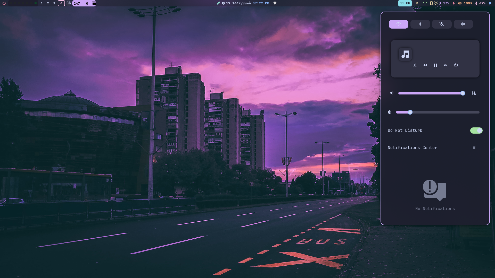
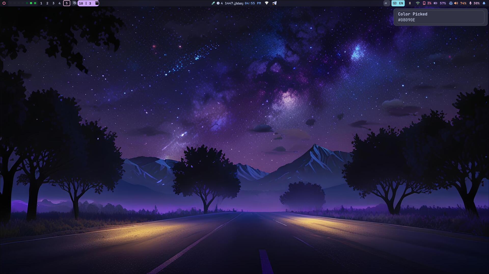

<div align="center">

**🇸🇦 العربية** | [**🇺🇸 English**](./README.md)

</div>

---

<div align="center">
  <h1>🍙 ملفاتي الإعدادية لـ Hyprland</h1>
  <p><i>إعداد Hyprland بسيط، مخصص بشكل كبير، وعملي على Arch Linux.</i></p>

  
  
  
  
  
  
</div>
<br>

مرحبًا بك في إعداداتي الشخصية لـ **Hyprland** (ملفات dotfiles).  
تم تصميم هذا الإعداد ليكون جميلًا من الناحية البصرية باستخدام لوحة ألوان Catppuccin، مع الحفاظ على أداء عالٍ وسهولة استخدام يومية.

## ✨ المميزات
- **سريع وخفيف:** مبني على Arch Linux مع مدير العرض Hyprland (Wayland).
- **واجهة جمالية:** دمج متناسق لثيم Catppuccin على مستوى النظام وتطبيقات GTK والطرفية.
- **Waybar متقدم:** شريط حالة معياري مع وحدات مخصصة (تقويم هجري، نقاط خصوصية ديناميكية، خريطة نشاط GitHub، مؤشر شحن الهاتف).
- **حركات سلسة:** إدارة نوافذ وانتقالات انسيابية.

## 🛠️ البرامج والأدوات

| الفئة | المكوّن |
|----------|-----------|
| **مدير النوافذ** | [Hyprland](https://hyprland.org/) |
| **شريط الحالة** | [Waybar](https://github.com/Alexays/Waybar) |
| **الشل** | [Zsh](https://www.zsh.org/) |
| **الطرفية** | [Kitty](https://sw.kovidgoyal.net/kitty/) |
| **مشغل التطبيقات** | [Rofi (Wayland)](https://github.com/lbonn/rofi-wayland)  |
| **الإشعارات** | [SwayNC](https://github.com/ErikReider/SwayNotificationCenter) |
| **مؤشر على الشاشة (OSD)** | [SwayOSD](https://github.com/ErikReider/SwayOSD) |
| **قائمة تسجيل الخروج** | [wlogout](https://github.com/ArtsyMacaw/wlogout) |
| **عارض الصوت المرئي** | [Cava](https://github.com/karlstav/cava) |
| **إعدادات GTK** | [nwg-look](https://github.com/nwg-piotr/nwg-look) |
| **الثيم** | [Catppuccin](https://github.com/catppuccin/catppuccin) |
| **الخلفيات** | [swww](https://github.com/LGFae/swww) |
<br>

## 🍧 إعداد Waybar

تفصيل الوحدات المستخدمة في إعداد Waybar:

### ⬅️ الوحدات اليسرى
| اسم الوحدة | النوع | الوصف |
| :--- | :--- | :--- |
| `custom/power` | **مخصص** 🛠️ | قائمة الطاقة / تسجيل الخروج (wlogout) |
| `custom/gh_heatmap` | **مخصص** 🛠️ | نشاط GitHub (خريطة أسبوعية) |
| `hyprland/workspaces`| مدمج 📦 | مبدّل مساحات العمل |
| `idle_inhibitor` | مدمج 📦 | إبقاء الشاشة نشطة (وضع القهوة ☕) |
| `custom/update` | **مخصص** 🛠️ | تحديثات النظام (Pacman/AUR) |

### ⏺️ الوحدات الوسطى
| اسم الوحدة | النوع | الوصف |
| :--- | :--- | :--- |
| `custom/colorpicker` | **مخصص** 🛠️ | أداة اختيار لون من الشاشة |
| `custom/hijri` | **مخصص** 🛠️ | التاريخ الهجري (للمسلمين) |
| `clock` | مدمج 📦 | الوقت والتاريخ الميلادي |
| `custom/privacy-dots`| **مخصص** 🛠️ | [مؤشرات الخصوصية (مايك, كاميرا, موقع)](https://github.com/alvaniss/privacy-dots) |
| `tray` | مدمج 📦 | أيقونات شريط النظام |

### ➡️ الوحدات اليمنى
| اسم الوحدة | النوع | الوصف |
| :--- | :--- | :--- |
| `mpris` | مدمج 📦 | التحكم بمشغل الوسائط |
| `custom/language` | مخصص 🛠️ | مؤشر لغة لوحة المفاتيح |
| `bluetooth` | مدمج 📦 | حالة واتصال البلوتوث |
| `network` | مدمج 📦 | حالة الشبكة والواي فاي |
| `battery` | مدمج 📦 | مستوى وحالة البطارية |
| `power-profiles` | مدمج 📦 | أوضاع الطاقة (أداء / توفير) |
| `pulseaudio` | مدمج 📦 | التحكم بالصوت |
| `pulseaudio#mic` | مدمج 📦 | التحكم بالميكروفون |
| `custom/notification`| **مخصص** 🛠️ | تبديل مركز الإشعارات (SwayNC) |

<br>

## 📂 البنية

- `~/.config/`: يحتوي إعدادات Hyprland وWaybar وKitty وWlogout وRofi وغيرها.
- `~/.icons/`: حزم أيقونات النظام والمؤشر.
- `~/.themes/`: ثيمات GTK (Catppuccin).

<br>

## 🚀 التثبيت

> **⚠️ ملاحظة:** يُرجى أخذ نسخة احتياطية من إعداداتك الحالية قبل المتابعة حتى لا تفقد إعدادك الحالي.

يمكنك تثبيت هذه الملفات بطريقتين:  
إما **أونلاين (أمر واحد)** أو **أوفلاين (يدويًا)**. اختر ما يناسبك.

### 🌐 الطريقة الأولى: التثبيت عبر الإنترنت
أسرع طريقة لتشغيل كل شيء. فقط الصق هذا الأمر في الطرفية:
#### غير مكتمل بعد.
```bash
bash -c "$(curl -fsSL https://raw.githubusercontent.com/ahmed-x86/hyprland_dotfiles/refs/heads/main/online-install.sh )" 
```
### 📦 الطريقة الثانية: التثبيت اليدوي (مستحسن)

إذا كنت تفضل استنساخ المستودع وفحص السكربتات قبل تشغيلها:

استنسخ المستودع

ثم اجعل السكربتات قابلة للتنفيذ ثم شغّل المثبت

```bash
git clone https://github.com/ahmed-x86/hyprland_dotfiles
cd hyprland_dotfiles
chmod +x *
./main.sh
```


📸 المعرض
<div align="center">






</div>

---